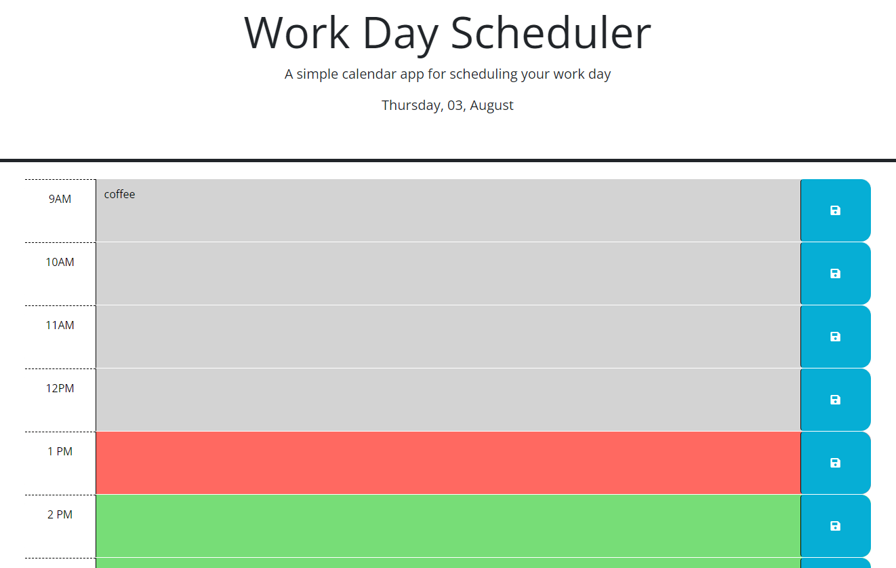

### Personal Calendar
this is a webpage for a scheduling application. The user can set an input into a text area and save the item to local storage. When the page is loaded the saved items will persist. The boxes color will correspond to the time of day. The current hour is red. Hours past are grey and future hours are colored green.

## Deployed link

https://cdziedzic.github.io/Personal-Calendar/

## Screenshot of application
